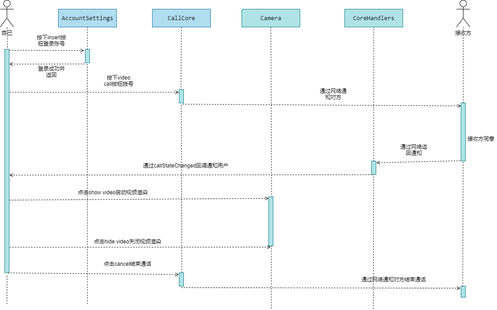
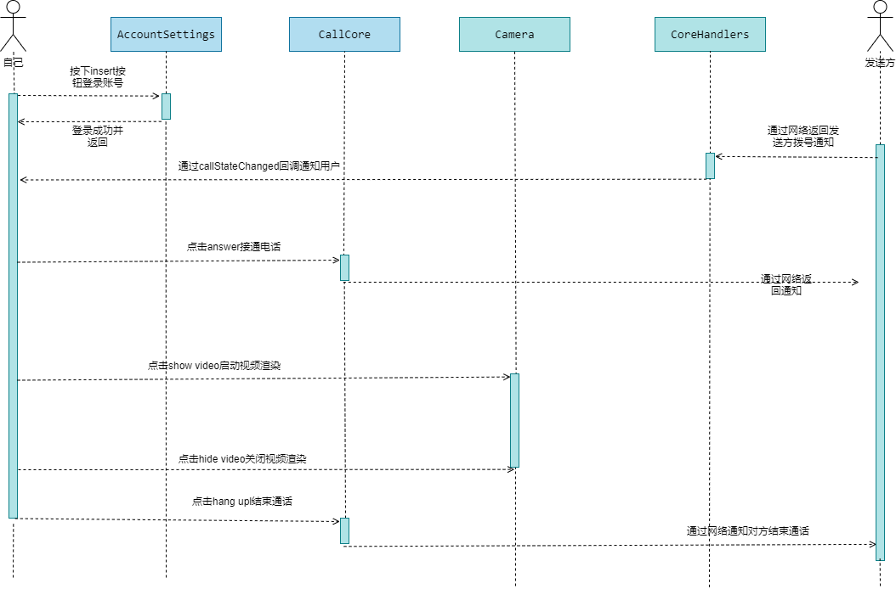

# Linephone Qt Demo

用于记录摘抄平时研究linphone库的问题和细节 
sdk编译步骤和问题记录在[这里](./doc/build.md)

- [Linephone Qt Demo](#linephone-qt-demo)
  - [项目说明](#项目说明)
    - [desktop-demo](#desktop-demo)
    - [quick-demo](#quick-demo)
      - [linphone组件说明](#linphone组件说明)
      - [demo组件说明](#demo组件说明)
      - [流程图](#流程图)
        - [core初始化流程图](#core初始化流程图)
        - [音视频拨出流程](#音视频拨出流程)
        - [音视频拨进流程](#音视频拨进流程)

## 项目说明
### desktop-demo
该项目是直接拿官网的linphone-desktop项目代码,只需要将编译好的sdk放在sdk路径即可编译运行  
因为源项目过于庞大,代码过多,所以我删减了一下代码,只留音视频组件,可以更快了解音视频的流程

### quick-demo
这个是我参考官网例子提取出来的部分音视频主要代码,下面我将讲解各个组件的作用

#### linphone组件说明
|  类名 | 作用 |
| :--- | :--- |
| ProxyConfig   | 用于记录SIP用户信息,包含用户的登录,删除,更新等
| Call          | 代表一个通话对象,通话之后就会生成一个该对象,通过该对象操作通话
| CoreListener  | 监听器,core的所有回调都通过该类回调,重点是call状态更改时的回调(包含拨号和接听)
| Core          | 该库核心,缺什么功能直接查看该类API
| Factory       | 该类用于获取工厂类实例,然后设置参数和创建core实例

以上的几个类基本上可以通过封装实现音视频通话

#### demo组件说明
|  类名 | 作用 |
| :--- | :--- |
| AccountSettings   | 摘抄于desktop-demo,用于增加SIP账号和删除账号,只要登录成功的账号,都会保存在config文件中,下次启动自动登录
| CallCore          | 用于qml中控制Call类,实现了音视频拨号,截屏,启动摄像头,中断通话,接受通话功能,同时通过handleCallStateChanged来回调获取通话拨进状态
| Camera            | 用于在qml中显示对方视频或者自己摄像头画面,需要注意的是,只有当通话状态为接通时,才可以实例化该类,否则会异常退出.还要注意需要先删除该对象才可以退出通话,否则也会异常退出
| SafeFramebuffer   | 用于在Camera找不到渲染器时,生成的空白渲染器让Camera正常运行
| CoreHandlers      | 继承CoreListener,用于监听Core的各种回调,目前主要关注core状态和call状态,core状态用于激活linphone事件循环计时器,call状态用于记录拨出,拨进和停止通话等情况
| LinphoneCoreManager| 核心管理器,提供对象给qml使用和core初始化操作
| LinphoneSettings   | 官方demo中的设置类,目前我用不上(没研究过),只是简单移植过来
| MediastreamerUtils | 也是官方demo中的类,用于采集音频,代码未作改动
| Utils              | 目前用于转换linphone和qt的字符串编码,只用的上coreStringToAppString和appStringToCoreString

#### 流程图
该流程图大致说明了linphone是如何工作的  

##### core初始化流程图

##### 音视频拨出流程

##### 音视频拨进流程
